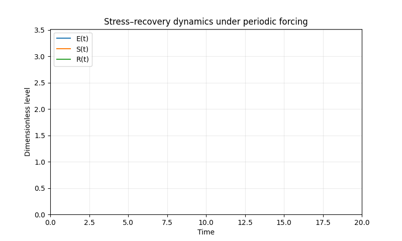
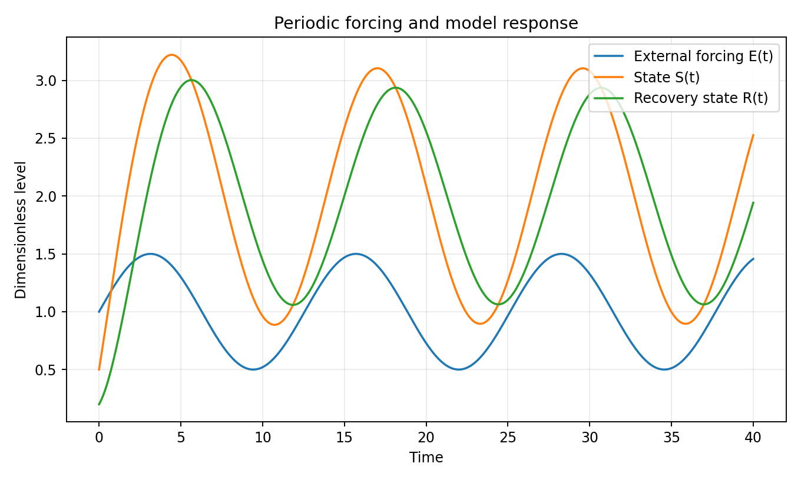
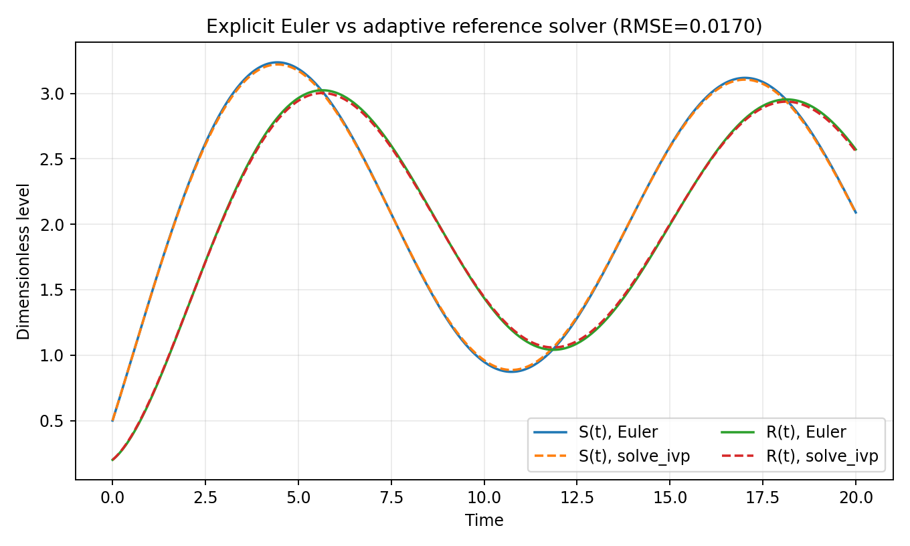
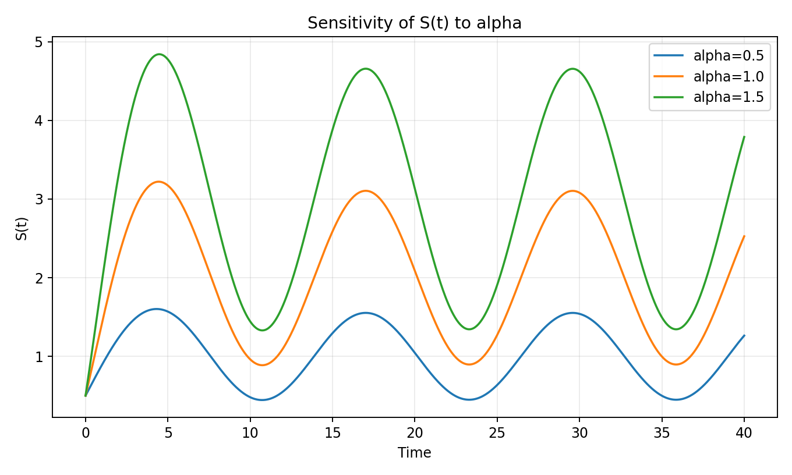
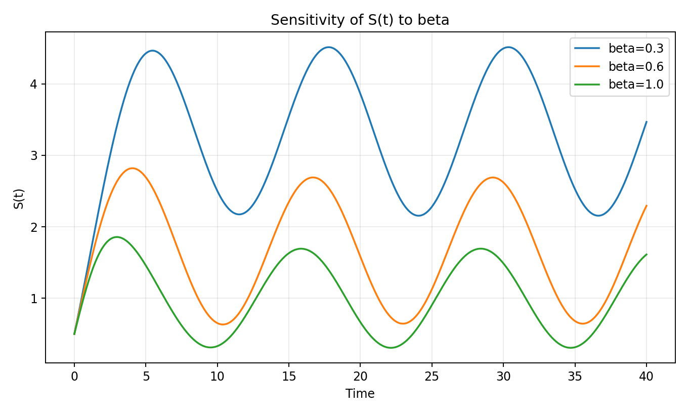
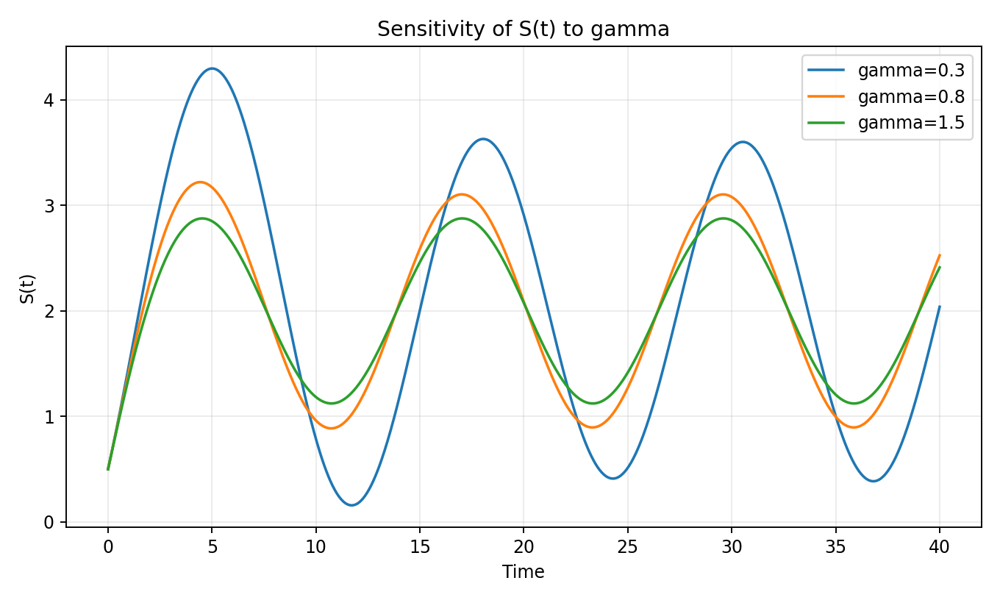
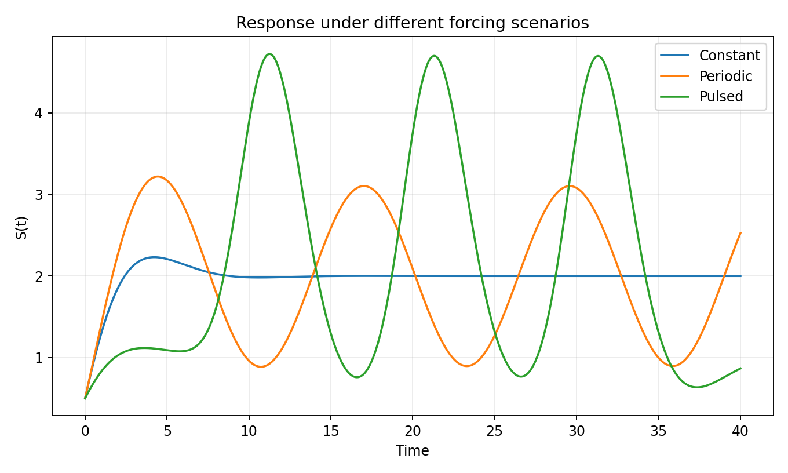
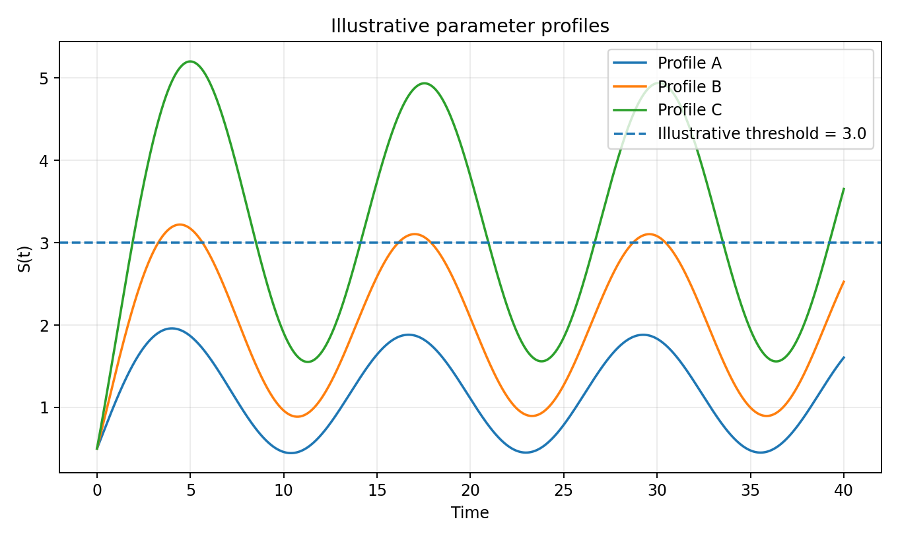

# Stress–Recovery Dynamics Model

A compact scientific-computing project that explores a **two-state coupled ODE system** under constant, periodic, and pulsed external forcing. The project includes analytical equilibrium/stability results, numerical simulation, parameter-sensitivity experiments, and a comparison between explicit Euler integration and SciPy's adaptive ODE solver.



> **Scope:** this is a stylized educational model. The variables are dimensionless and the project is **not** a medical, psychological, or diagnostic tool.

## Model

The system is

```text
dS/dt = alpha * E(t) - beta * R
dR/dt = gamma * (S - R)
```

where `E(t)` is external forcing and `alpha`, `beta`, `gamma` control response strength, recovery feedback, and adaptation rate.

For constant forcing `E(t)=E0`, the equilibrium is

```text
S* = R* = alpha * E0 / beta
```

The Jacobian is

```text
[[ 0,     -beta],
 [ gamma, -gamma]]
```

and its characteristic polynomial is `lambda^2 + gamma*lambda + beta*gamma = 0`. For positive `beta` and `gamma`, the equilibrium is asymptotically stable.

For the default parameters (`alpha=1.0`, `beta=0.5`, `gamma=0.8`) the Jacobian eigenvalues are approximately `-0.400+0.490j` and `-0.400-0.490j`.

## Highlights

- Coupled ordinary differential equations (ODEs)
- Analytical equilibrium and stability analysis
- Explicit Euler solver implemented from scratch
- Cross-check against `scipy.integrate.solve_ivp`
- Sensitivity analysis for `alpha`, `beta`, and `gamma`
- Constant, periodic, and Gaussian-pulse forcing scenarios
- Animated trajectory visualization
- Automated tests and GitHub Actions CI

## Results

### Default dynamics



### Euler vs. adaptive reference solver

The corrected explicit Euler implementation evaluates the forcing at the beginning of each integration step. With `401` points over `t = 0..20`, its combined-state RMSE against the adaptive reference solution is approximately **0.0170**.



### Parameter sensitivity

**Response strength (`alpha`)**



**Recovery feedback (`beta`)**



**Adaptation rate (`gamma`)**



### Forcing scenarios



### Illustrative parameter profiles

The threshold shown below is only a model-analysis device, not a real-world cutoff.



## Project structure

```text
stress-recovery-dynamics-model/
├── README.md
├── requirements.txt
├── .gitignore
├── assets/
│   ├── stress_recovery_dynamics.gif
│   ├── default_dynamics.png
│   ├── euler_vs_reference.png
│   ├── forcing_scenarios.png
│   ├── illustrative_profiles.png
│   └── sensitivity_*.png
├── notebooks/
│   └── stress_recovery_dynamics.ipynb
├── src/
│   ├── __init__.py
│   └── stress_recovery.py
├── tests/
│   └── test_model.py
└── .github/workflows/
    └── tests.yml
```

## Run locally

```bash
git clone <your-repository-url>
cd stress-recovery-dynamics-model
python -m venv .venv
```

Activate the virtual environment, then install the dependencies:

```bash
pip install -r requirements.txt
jupyter notebook notebooks/stress_recovery_dynamics.ipynb
```

Run the automated checks with:

```bash
pytest -q
```

## Technologies

Python · NumPy · SciPy · Matplotlib · Jupyter · Pytest · GitHub Actions

## What was improved from the coursework version

- corrected the explicit Euler forcing index (`E[i-1]` for the step from `t[i-1]` to `t[i]`);
- completed the analytical stability argument using the Jacobian eigenvalues;
- added an adaptive-solver reference comparison;
- replaced person/"burnout risk" wording with neutral illustrative parameter profiles;
- clarified that the threshold and model states are not clinically validated;
- moved reusable numerical code into `src/` and added tests/CI;
- translated code, plots, and documentation to English for portfolio use.

## Limitations

This model is intentionally simple. Parameters are not estimated from empirical human-subject data, units are abstract, and the model omits many mechanisms that would be necessary for real psychological or physiological interpretation.
